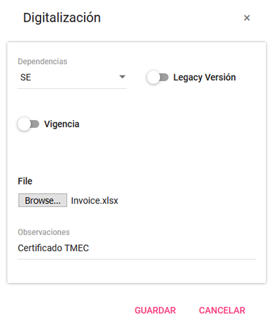
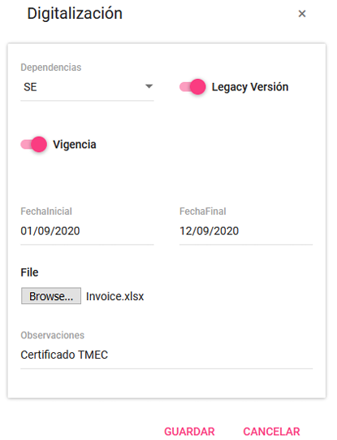
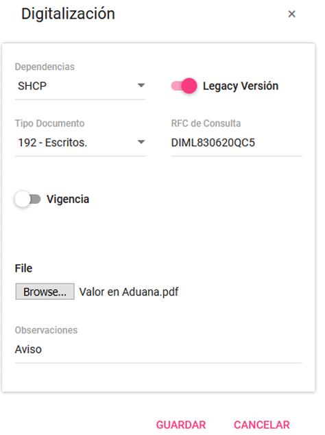
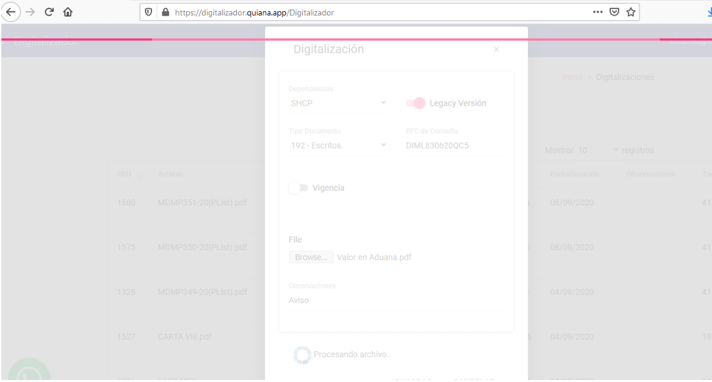
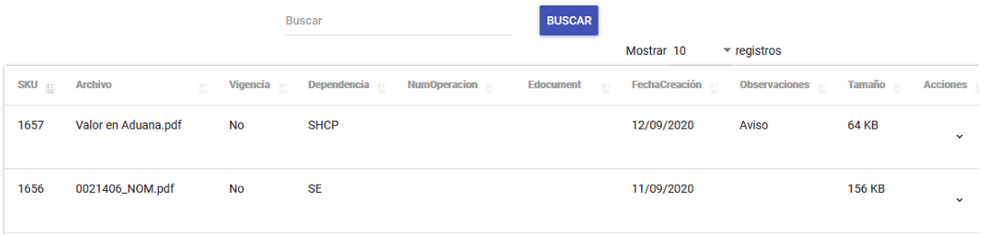

**Ejemplo de digitalización de documentos con datos mínimos** 

---

{ align=center style="display: block; margin: 0 auto;" }

---

**Ejemplo de digitalización de documentos con datos mínimos, aplicando vigencias al documento**
{ align=center style="display: block; margin: 0 auto;" }

---

**Ejemplo de digitalización de documentos con la dependencia SHCP**

{ align=center style="display: block; margin: 0 auto;" }

---

Una vez que selecciona la opción de **GUARDAR** inicia el proceso de conversión este puede 
tardar dependiendo de la cantidad de páginas y tamaño del documento. 

{ align=center style="display: block; margin: 0 auto;" }

---

**El proceso de conversión y digitalización se mostrará el registro en la parte superior del listado.**

!!! note "La ordenación es del más reciente al más antiguo (Descendente)" 
    
