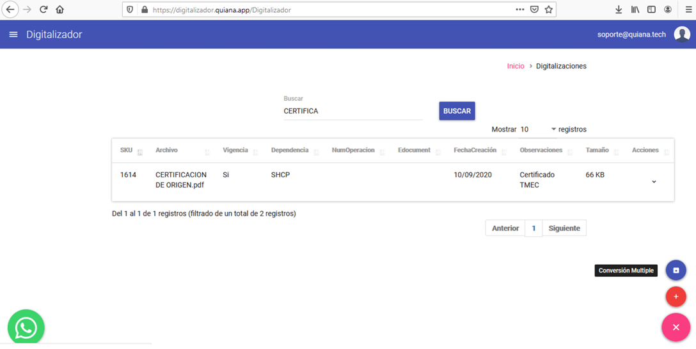
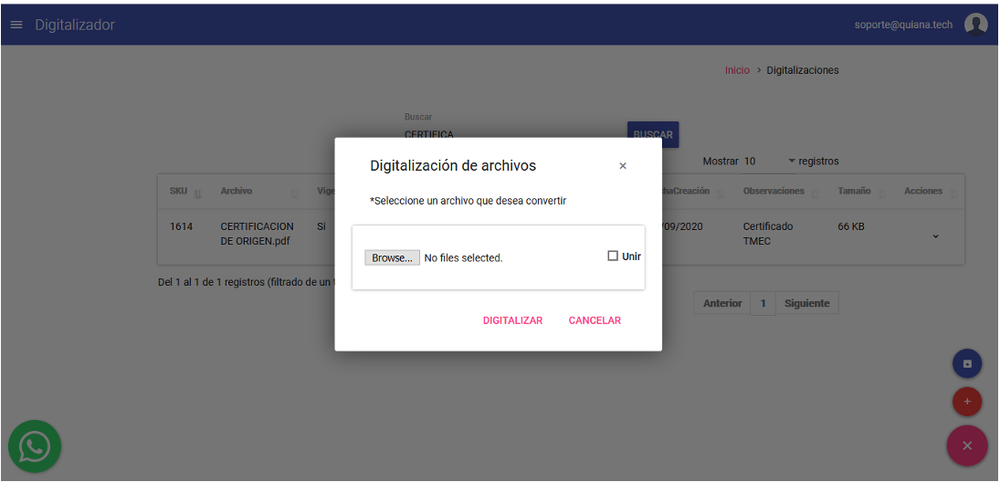
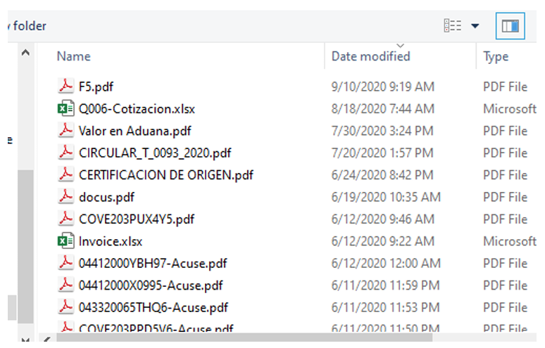

# Digitalización Múltiple

La opción de **Digitalización Múltiple** permite convertir múltiples documentos de diferentes formatos y tipos de manera simultánea, seleccionando la opción de conversión múltiple.

## Proceso de Digitalización

1. **Seleccionar la opción de Conversión Múltiple**  
   En la pantalla principal, seleccione la opción de **Conversión múltiple**. Esto mostrará la siguiente interfaz:

   

2. **Seleccionar Archivos**  
   Haga clic en el botón **Browse… (Explorar…)** para seleccionar los archivos que desea convertir.

3. **Unir Archivos (Opcional)**  
   Si desea combinar o unir varios archivos en un solo PDF, marque la opción **Unir**.

   

---
!!! warning "Es necesario considerar los formatos soportados: "
    - **Word**  
    - **Excel**  
    - **PDF**
    - **PNG, JPG, BMP, TIF**
---

!!! info ""
      La funcionalidad de **Digitalización Múltiple** es ideal para procesar grandes volúmenes de documentos de manera eficiente, asegurando que cumplan con los estándares técnicos requeridos.