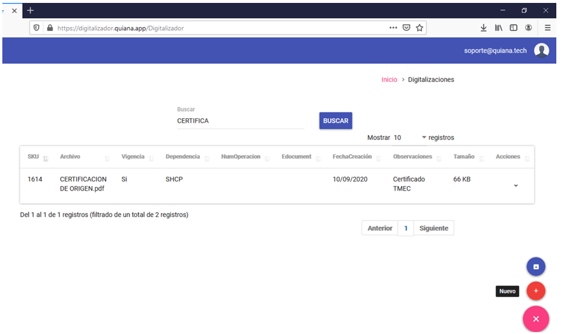
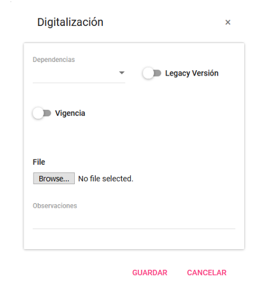
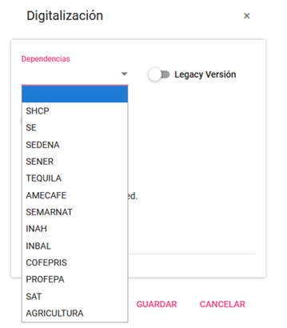
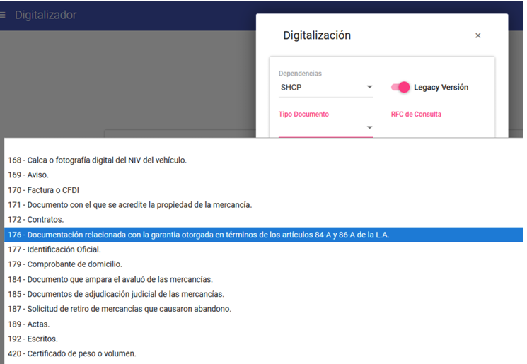

# Digitalización Simple

En esta opción podrá convertir y digitalizar cualquier tipo de documento soportado, además de llevar una administración y control de los documentos proporcionando más detalles.  
Para esto, seleccione la siguiente opción que se muestra en la imagen.

---

## Datos requeridos para la administración de documentos

{ align=left }

???+ abstract "Paso 1"
    1. **Dependencia:** Seleccione la dependencia que aplique al trámite que va a realizar.

???+ abstract "Paso 2"
    2. **Tipos de Documentos:** Esta opción se muestra cuando la dependencia seleccionada es DHCP y cuando se quiera transmitir el documento para obtener el **EDocuments**.
???+ abstract "Paso 2"
    3. **RFC de Consulta:** Este campo es obligatorio y solo se muestra cuando la dependencia seleccionada es DHCP y cuando se quiera transmitir el documento para obtener el **EDocuments**.
???+ abstract "Paso 3"
    4. **Legacy Versión:** Use esta opción por defecto (deshabilitada). Permite mantener la legibilidad y calidad del documento. Si activa esta opción, optimizará el documento al máximo, pero podría reducir la calidad y legibilidad.

---

!!! tip "Tip"
    La optimización reduce el tamaño y calidad del archivo, por lo cual puede perder la legibilidad y la calidad (por defecto en la versión gratuita).

{ align=right }

5. **Vigencia:** Active esta opción en caso de que su documento 
tenga alguna vigencia. 
6. **Browse… (Explorar …):** Esta opción es para seleccionar un 
documento de cualquier formato soportado. 
!!! danger "Nota"
    Solamente se permite la conversión y selección de un solo documento. 
7. **Guardar:** Registra el documento en el listado principal para su control y administración 
8. **Cancelar:** Cancela la conversión o digitalización.

---

