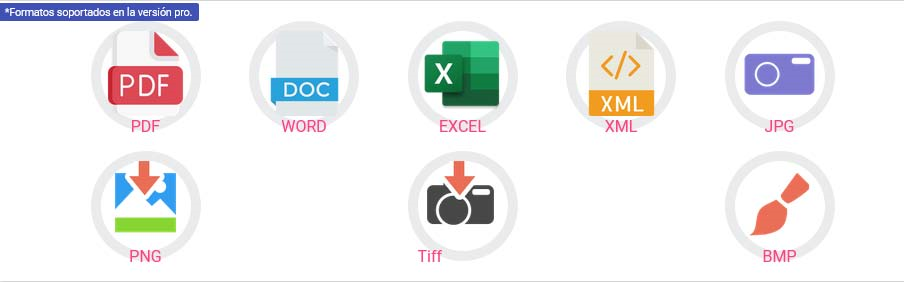

# Introducción

**Digitalizador VUCEM** es una aplicación web que convierte documentos (PDF, WORD, EXCEL, XML, BMP PNG, JPG, XML, etc.) a los especificaciones técnicas de **[VUCEM](https://www.ventanillaunica.gob.mx/vucem/index.html){:target="_blank"}** (Ventanilla Única de Comercio Exterior Mexicano). Estos requisitos son esenciales para realizarcualquier tipo de trámites ante las diferentes dependencias gubernamentales: SAT, SE-DGN, AGRICULTURA, SEMARNAT, SEDENA, SALUD, SENER, PROFEPA, INBA, INAH y dos organismos reguladores AMECAFE y CRT.

<!--Una de las ventajas es, cuando el documento ya se encuentra en formato digital o electrónico no es necesario imprimir y escanear nuevamente, con el Digitalizador VUCEM convierte cualquier documento (soportado) para cumplir con las especificaciones requeridas de una manera fácil, rápida y sencilla con esto te permitirá cumplir con las especificaciones de la Ventanilla Digital-->

### Ventajas Principales

- **Optimización del proceso**: Si el documento ya está en formato digital o electrónico, no es necesario imprimir y escanear nuevamente.
- **Conversión eficiente**: Transforma cualquier documento soportado para cumplir con las especificaciones requeridas de manera fácil, rápida y sencilla.
- **Cumplimiento garantizado**: Asegura que los documentos cumplan con las especificaciones de la Ventanilla Digital.

### Requerimientos de Ventanilla Única

!!! info "Especificaciones Técnicas"
    - **Formato**: Solo archivos de tipo pdf 
    - **Color**: Escala de grises  
    - **Resolución**: 300 DPI (Puntos por pulgada)
	- **Profundidad**: 8 bits
	- **Tamaño**: 3 MB *Para algunas dependencias.

### Formatos Soportados
!!! warning "Con version pro"
    
