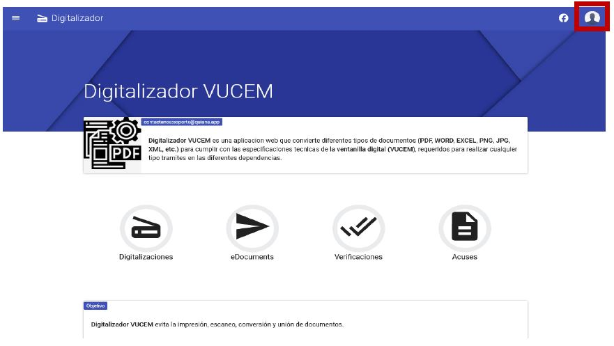
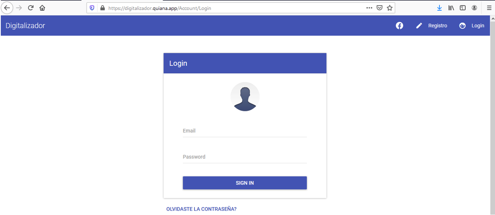
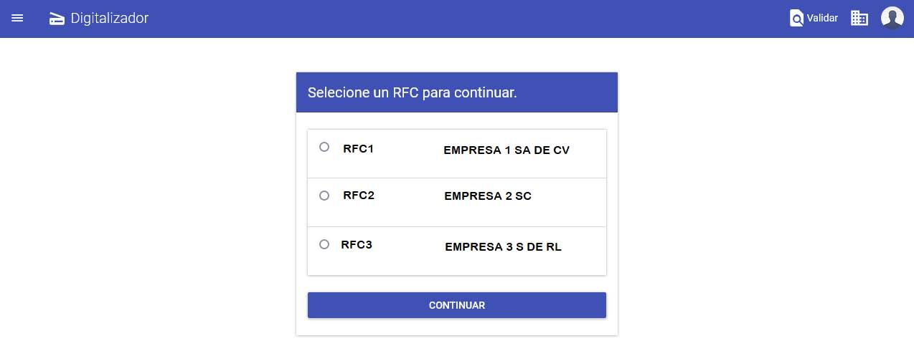
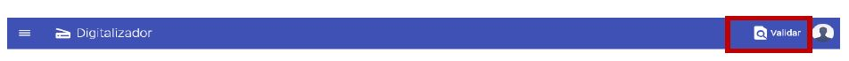
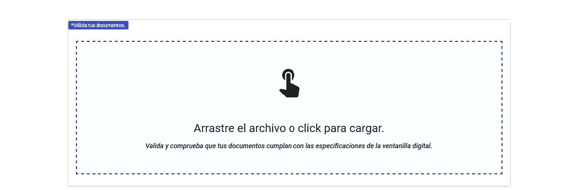

Para ingresar a la aplicación Web ingrese a la siguiente dirección: [Digitalizador VUCEM](https://digitalizador.quiana.app/). 
Posteriormente seleccione la opción de la barra superior la opción de **Login**. 

Ingrese los datos proporcionados por el administrador o proveedor del sistema la cual se compone de un correo electrónico y una contraseña. 

!!! note

    ¿En caso de no recordar la contraseña puede reestablecerla seleccionado la opción de 
    **OLVIDASTE LA CONTRASEÑA?** o también lo puede solicitar al proveedor del sistema a [soporte@quiana.app](mailto:soporte@quiana.app?subject=Recuperacion de contraseña).

### Multiempresas
En caso de que haya adquirido la licencia de Multiempresas se mostrara la siguiente pantalla después de iniciar sesión.

### Validador de DPI's
Para verificar que sus documentos o archivos cumplan con las especificaciones de la Ventanilla Única (300 DPI, Escala de Grises, etc.) en el sistema podrás encontrar la opción de Validar en la barra superior (navbar) como se muestra en la imagen.

En este apartado podrás seleccionar el documento o archivo que se pretende validar y /o verificar.

