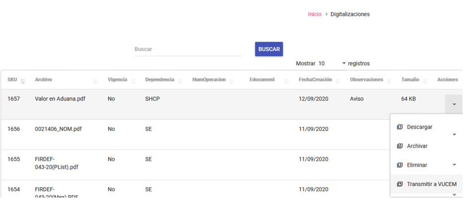
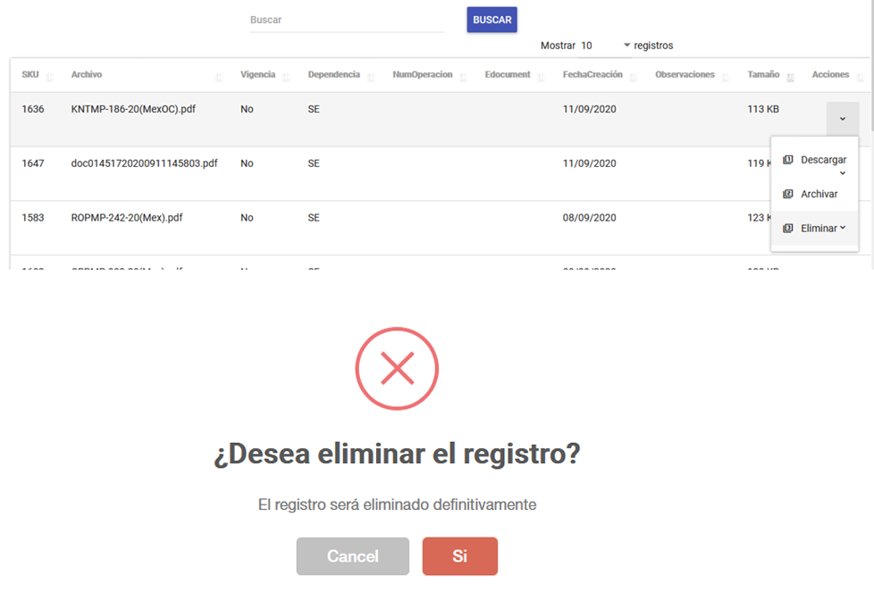
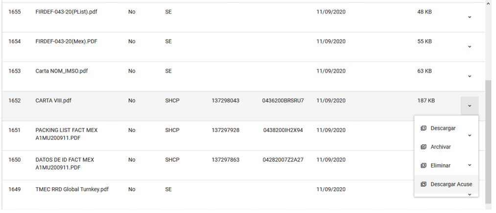
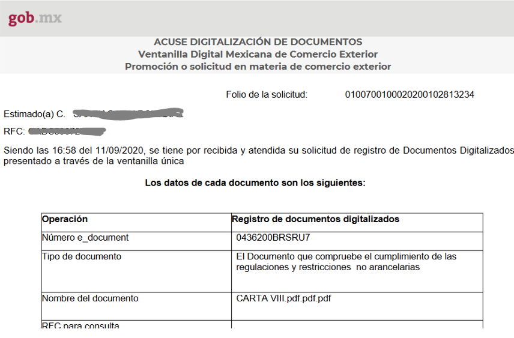
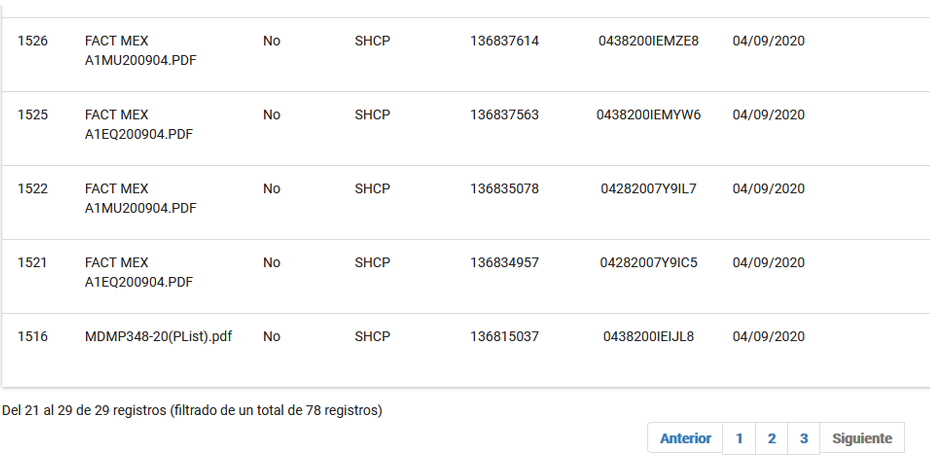

**Dentro del listado se mostrarán las siguientes acciones por registro:**

---

!!! abstract ""
    1. **Descargar:** Permite descargar a la computadora local el documento digitalizado o convertido. 
    2. **Archivar:** Permite ocultar el archivo dentro del listado 
    3. **Eliminar:** Elimina permanentemente el documento dentro del listado 

---

!!! abstract ""
    4. **Transmitir a VUCEM:** En caso de que la dependencia haya sido DHCP se mostrara la 
    siguiente la opción. 
    5. **Descargar acuses:** Una vez que se haya obtenido el EDocument se podrá obtener el 
    Acuse (PDF). 

---

**En la opción de Descargar Acuse se obtendrá un documento como se muestra en la siguiente imagen.**

{ align=center style="display: block; margin: 0 auto;" }

---

!!! info 
    Para la transmisión a VUCEM y la descarga de Acuse es necesario tener configurado 
    los datos requeridos en el módulo de Configuración. 
    Así mismo en la parte inferior del listado de documentos podrá ver la cantidad de documentos 
    que han sido digitalizados, en la cual estará seccionado por paginas para una fácil navegación. 

