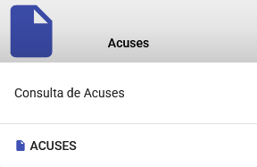
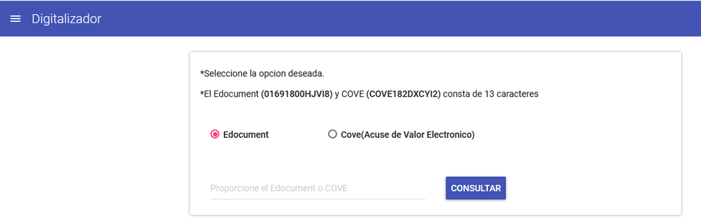
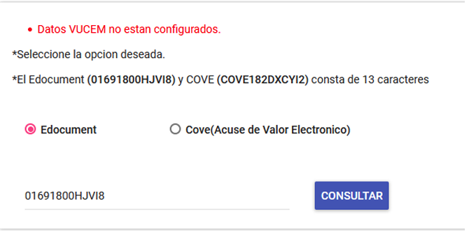
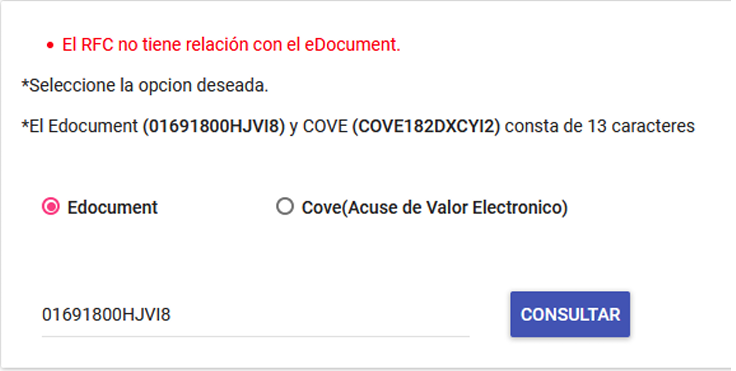
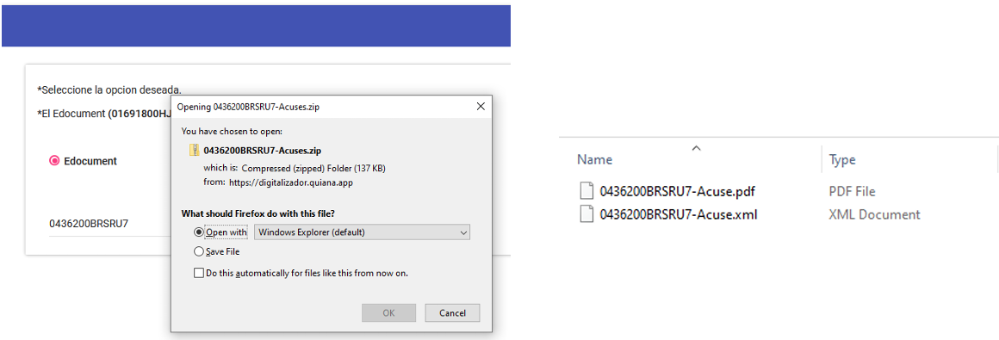
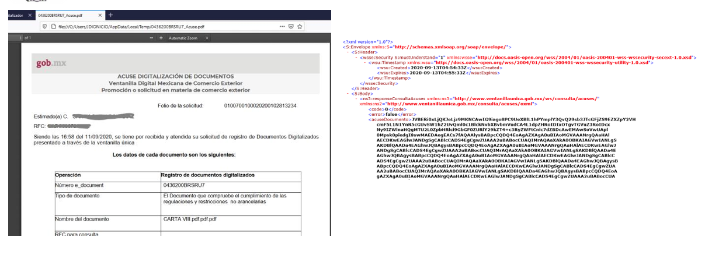

{ align=center style="display: block; margin: 0 auto;" }

---

!!! info ""
    En este modulo se podrá consultar los acuses **(EDocuments y Coves)** directamente de VUCEM 
    obteniendo como resultado el PDF y XML de los acuses consultados. Para esto es necesario 
    proporcionar un numero compuesto de 13 caracteres como se muestra en la siguiente imagen.

 

---

**En caso de que no se tenga los datos configurados mostrara el siguiente error.** 

---

**Así mismo cuando el EDocument o Cove no corresponda a la empresa que está consultando mostrara el siguiente error.** 

---

**Y cuando la consulta es exitosa se obtendrá el siguiente archivo comprimido (ZIP) la cual contiene el PDF y XML del acuse consultado.**

{ style="width: 150%; display: block; margin: 0 auto;" }

---

!!! info ""
    { style="width: 150%; display: block; margin: 0 auto;" }