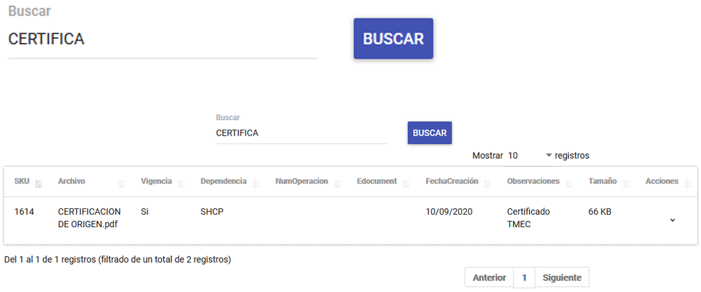

# Buscador

El módulo **Buscador** permite localizar cualquier información contenida dentro de la tabla o listado de documentos. Solo es necesario escribir una parte, contenido o el texto completo que se desea buscar para obtener los resultados deseados.

La imagen anterior muestra la interfaz del buscador, diseñada para facilitar la localización de documentos de manera rápida y eficiente.

---

## Listado de Documentos

En la tabla o lista de documentos, se puede observar la siguiente información clave:

- **SKU**: Identificador único del documento.
- **Archivo**: Nombre del archivo.
- **Vigencia**: Indica si el documento tiene fechas marcadas (Sí/No).
- **Dependencia**: Dependencia asociada al documento.
- **NumOperacion**: Número de operación en caso de haber transmitido el **EDocument**.
- **EDocument**: Número obtenido en VUCEM.
- **FechaCreacion**: Fecha en la que se creó el documento.
- **Observaciones**: Notas adicionales relacionadas con el documento.
- **Tamaño**: Tamaño del archivo.
- **Acciones**: Opciones disponibles para interactuar con el documento.

La imagen anterior muestra un ejemplo del listado de documentos, donde se puede visualizar y gestionar toda la información relevante.

---
!!! info ""
    El módulo **Buscador** es una herramienta esencial para agilizar la búsqueda y gestión de documentos dentro del sistema, asegurando un acceso rápido y organizado a la información.