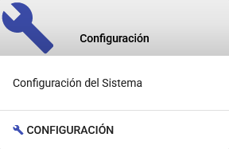
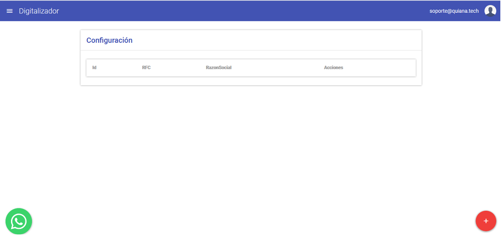
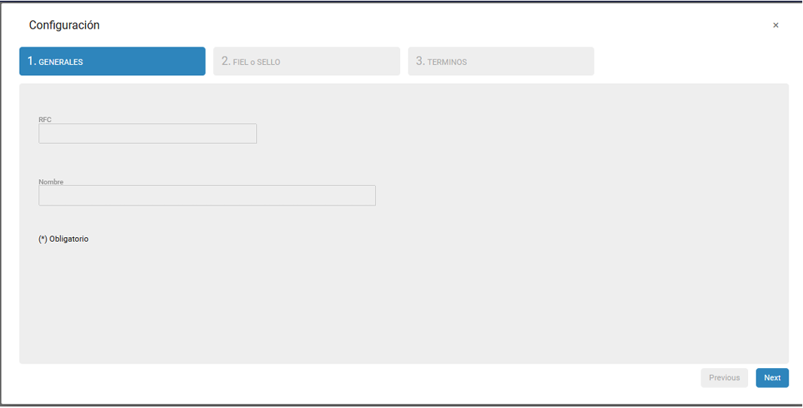
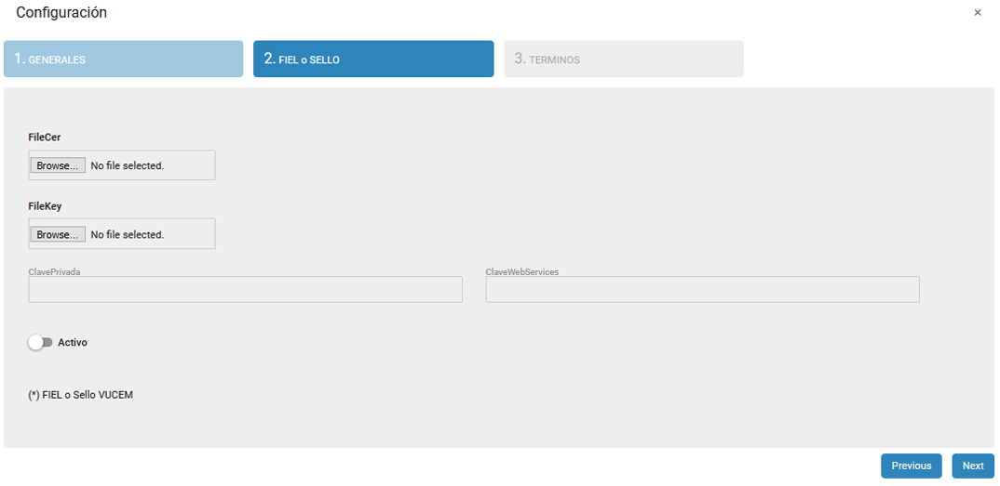
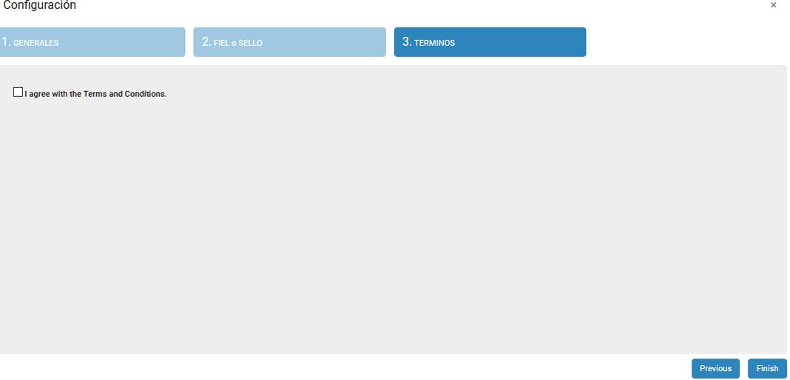
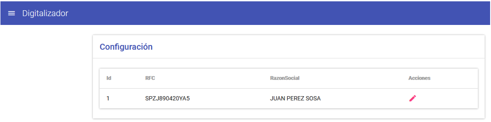
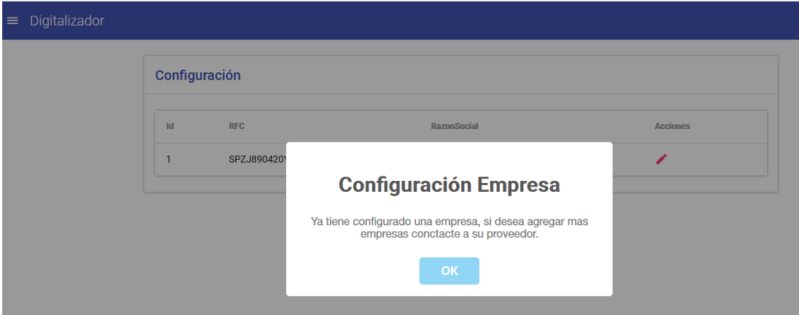

{ align=center style="display: block; margin: 0 auto;" }

---

# Configuración de Datos de la Empresa

En este módulo se realiza la configuración de los datos de la empresa para poder realizar la transmisión de **EDocuments** y la consulta de **Acuses**.

## Listado Principal

En el listado principal de configuración de la empresa, para agregar los datos de la empresa, seleccione la opción de **Agregar (+)**.

---

## Datos Requeridos

!!! warning "Datos Requeridos"
    1. **RFC**  
    2. **Nombre o Razón Social**  
    3. **Clave Privada y Clave Web Services**  
    4. **Archivo CER y KEY**

---

## Pasos para Configurar los Datos

### Paso 1: Datos Generales

### Paso 2: FIEL o SELLO VUCEM

### Paso 3: Aceptar Términos y Condiciones

---

## Registro de la Empresa

Una vez configurados los datos, se mostrará el registro de la empresa con los datos configurados.

---

## Configuración Adicional

En caso de que requiera agregar más datos de configuración, es necesario contactar al proveedor del sistema.

