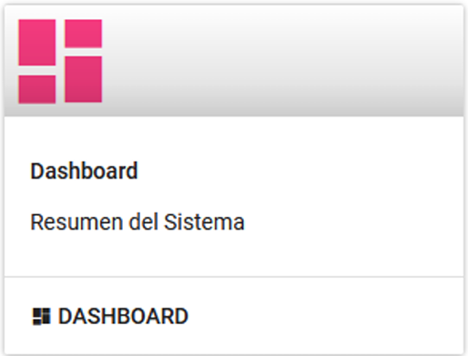
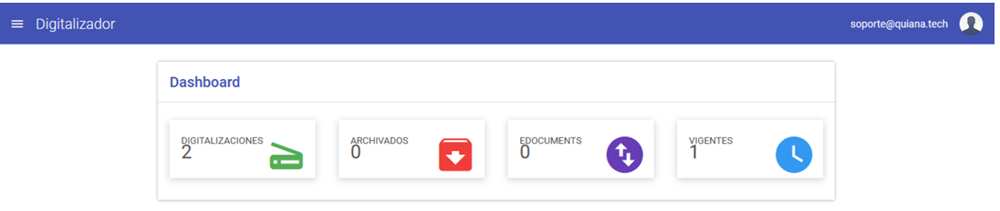

# Dashboard

El **Dashboard** proporciona una vista general y resumida de los documentos procesados en el sistema. Aquí podrá encontrar información clave sobre:

- Documentos digitalizados.
- Documentos archivados.
- Documentos vigentes.
- Documentos con **EDocuments**.

## Vista General del Dashboard

La imagen anterior muestra la interfaz principal del Dashboard, donde se resumen los datos más relevantes del sistema.

## Detalles del Dashboard

En esta sección, se presentan detalles adicionales sobre los documentos procesados, permitiendo un análisis más profundo y organizado de la información.

---

!!! info ""
    El Dashboard es una herramienta esencial para monitorear el estado de los documentos y garantizar un flujo de trabajo eficiente dentro del sistema.