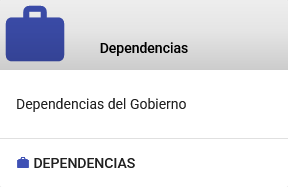
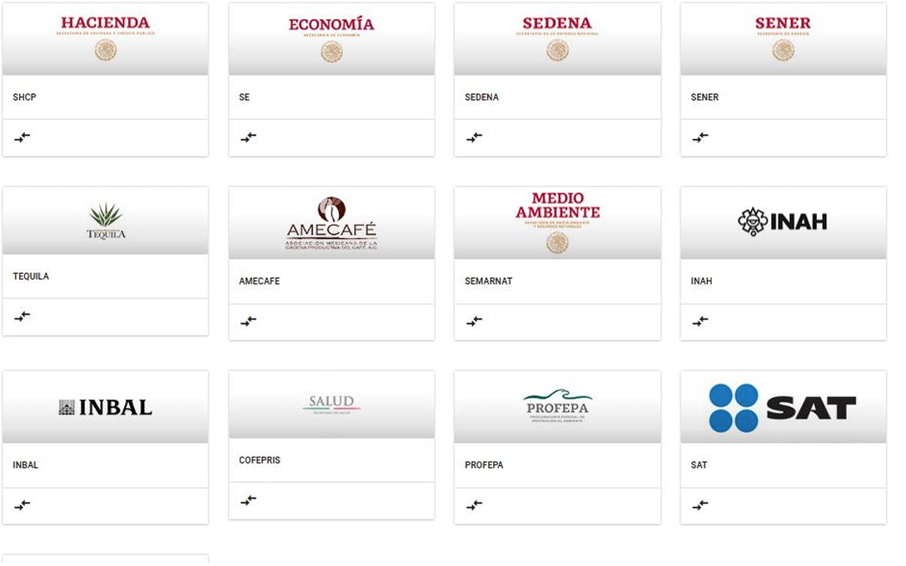
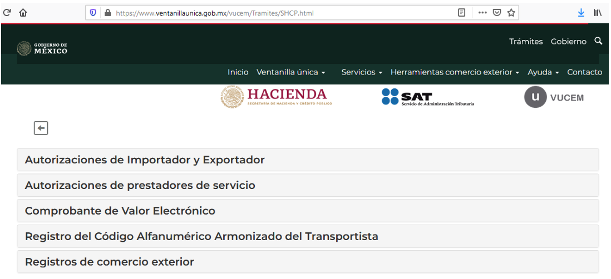

{ align=center style="display: block; margin: 0 auto;" }

---

# Dependencias

En este módulo se muestran las diferentes dependencias, así como los trámites y requisitos necesarios que se deben cumplir al momento de realizar el trámite en la ventanilla digital **VUCEM**.

---

## Vista General de las Dependencias

La siguiente imagen muestra un ejemplo de cómo se presentan las dependencias y los trámites asociados en el sistema:

---

## Ejemplos de Trámites

A continuación, se presentan ejemplos de trámites que pueden realizarse en las dependencias:

---

## Información Adicional

Para más detalles sobre los trámites y requisitos específicos, consulte la documentación oficial de cada dependencia o contacte al soporte técnico.