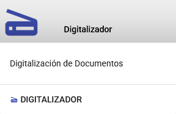
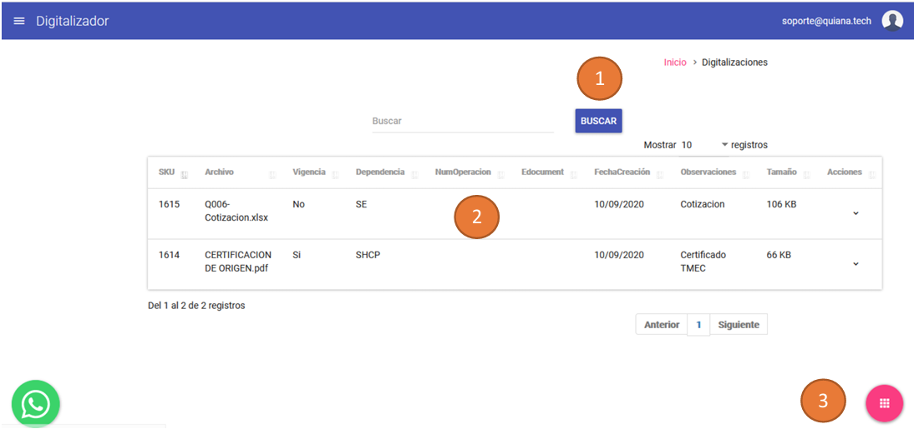

# Digitalizador

{ align=center style="display: block; margin: 0 auto;" }
<!-- El módulo **Digitalizador** permite convertir documentos con las especificaciones requeridas por la Ventanilla Única. En la pantalla principal, se muestra una lista de documentos digitalizados o convertidos con los siguientes datos y opciones: -->
En esta opción podrá para administrar, guardar (temporalmente) y transmitir los documentos ya convertidos a las especificaciones a VUCEM, en la pantalla principal se mostrará una lista de documentos digitalizados con los siguientes datos y opciones:

## Funcionalidades Principales

1. **Búsqueda**: Encuentra documentos específicos de manera rápida y eficiente.
2. **Listado de Documentos**: Visualiza todos los documentos procesados en el sistema.
3. **Opciones de Digitalización**:
   - **Múltiples**: Permite procesar varios documentos al mismo tiempo.
   - **Únicos**: Procesa documentos de manera individual.

La imagen anterior muestra la interfaz principal del módulo Digitalizador, donde se pueden gestionar los documentos digitalizados.

## Opciones de Digitalización

En esta sección, se presentan las opciones disponibles para digitalizar documentos, ya sea de forma múltiple o única, según las necesidades del usuario.

---
!!! info ""

      El módulo **Digitalizador** es una herramienta clave para garantizar que los documentos cumplan con los estándares técnicos requeridos, optimizando el flujo de trabajo y asegurando la calidad de los archivos procesados.